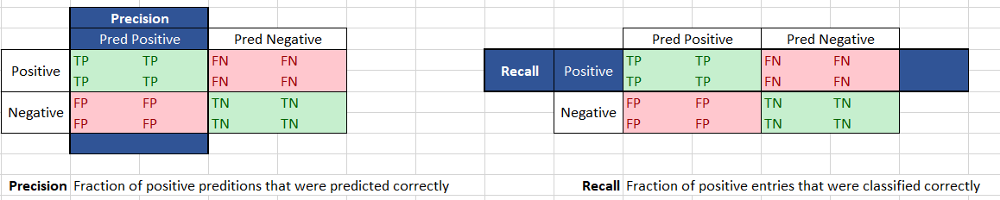

==========
Statistics
==========

p value
+++++++

Risk taken when rejecting null hypothesis.
Ideally p value should be less than 0.05 or <5% risk

Homoscedasticity vs Heteroscedasticity
++++++++++++++++++++++++++++++++++++++
*reference*: stat_ref_scedasticity_

use Goldfeld-Quandt test

- Homoscedasticity
    Variability of dependent variable
    is constant across independent variable

- Heteroscedasticity
    Variability of dependent variable
    is not constant across independent variable

Conditional Probability
+++++++++++++++++++++++

*reference*

1. stat_ref_condprob_summary_ex_
2. stat_ref_condprog_better_sum_

The conditional probability of an event B is the probability
that the event will occur given the knowledge that an
event A has already occurred.

If events A and B are not independent, then the probability
of the intersection of A and B (the probability that both
events occur) is defined by P(A and B) = P(A)P(B|A).

To calculate the probability of the intersection of more than
two events, the conditional probabilities of all of the
preceding events must be considered. In the case of three
events, A, B, and C, the probability of the intersection
P(A and B and C) = P(A)P(B|A)P(C|A and B).

.. math:: `P(A|B) = \frac{P(A)P(B|A)}{P(B)}`

Bayes Theorem
+++++++++++++

*reference*

1. stat_ref_condprob_summary_ex_
2. stat_ref_condprog_better_sum_

Another important method for calculating conditional
probabilities is given by Bayes's formula. The formula
is based on the expression.

.. math:: `P(B) = P(B|A)P(A) + P(B|A_c)P(A_c)`

which simply states that the probability of event B
is the sum of the conditional probabilities of event B
given that event A has or has not occurred.

For independent events A and B, this is equal to
P(B)P(A) + P(B)P(A_c) = P(B)(P(A) + P(A_c)) = P(B)(1) = P(B),
since the probability of an event and its complement must
always sum to 1.

Bayes's formula is defined as follows:

.. math:: `P(A|B)=\frac{P(A)(P(B|A)}P(B)`

Kurtosis and skewness
+++++++++++++++++++++

*references*
 1. stat_ref_kurtosis_skew_concise_
 2. stat_ref_kurtosis_skew_descriptive_
 3. stat_ref_kurtosis_skew_basic_

**skewness**: is the degree of distortion from the
symmetrical bell curve or the normal distribution.

.. image:: https://cdn-images-1.medium.com/max/1600/1*nj-Ch3AUFmkd0JUSOW_bTQ.jpeg

**Positive Skewness**

    - **Tail** on the **right** side of the distribution is
      **longer** or **fatter**.
    - **mean** and **median** are **greater than** the **mode**.

**Negative Skewness**

    - **Tail** of the **left** side of the distribution
      is **longer** or **fatter**
    - The **mean** and **median** are **less than** the **mode**.

**Kurtosis**:
              It is used to describe the extreme values
              in one versus the other tail.

              It is actually the **measure of outliers**
              present in the distribution
              **not the peakedness**

.. math:: `\frac{n}{(n-1)(n-2)}\sum_{i=1}^{n}{\frac{X_i-\bar{X}}{\sigma^3}} \\ where  \\ X_i = i^{th} \space element \space of \space distribution \\ \bar{X} = mean \space of \space the \space distribution \\ n = number \space of \space elements \space in \space distribution \\ \sigma = standard \space deviation \space of \space distribution`

*High kurtosis is Indicator that data has heavy
tails or outliers.*

*Low kurtosis is indicator that data has light tails or lack of outliers.*

Even if we get low kurtosis (too good to be true),
we should investigate and trim the dataset of unwanted results

.. math:: `skewness = \frac{n(n+1)}{(n-1)(n-2)}\sigma(\frac{(x-\bar{x})}\sigma)^3`

.. math:: `kurt = \frac{n(n+1)}{(n-1)(n-2)(n-3)}(\frac{(x-\bar{x})}\sigma)^4-\frac{3(n-1)^2}{(n-2)(n-3)}`

.. image:: https://cdn-images-1.medium.com/max/1600/1*Nqu07THa7APRTOF7kaVr5Q.jpeg

**Mesokurtic**:

    kurtosis statistic is similar to that of the normal distribution.

    It means that the extreme values of the distribution
    are similar to that of a normal distribution characteristic.
    The standard normal distribution has a kurtosis of three.

**Leptokurtic (Kurtosis > 3)**:

    Distribution is longer, tails are fatter.Peak is
    higher and sharper than Mesokurtic,
    means that data are heavy-tailed or profusion of outliers.

    Outliers stretch the horizontal axis of the histogram
    graph, which makes the bulk of the data appear in a
    narrow (“skinny”) vertical range, thereby giving the
    “skinniness” of a leptokurtic distribution.

**Platykurtic: (Kurtosis < 3)**:

    Distribution is shorter, tails are thinner than the normal distribution.
    The peak is lower and broader than Mesokurtic, which means
    that data are light-tailed or lack of outliers.

    The reason for this is because the extreme values are less
    than that of the normal distribution.

**Jarque-Bera test of normality**
 - A test of normality recommended by some authors is the Jarque-Bera test.

   This is based on the distribution of a combined measure of
   skewness and kurtosis.

 - A test of normality recommended by some authors is the Jarque-Bera test.
   This is based on the distribution of a combined measure of skewness and
   kurtosis.
 - The statistic J has an asymptotic chi-square distribution with two degrees
   of freedom. However, convergence to this distribution is slow and irregular
   and Monte Carlo methods should be used for small samples (n < 100).

Co-relation vs Co-Variance
++++++++++++++++++++++++++
 *reference*
     1. stat_ref_corelation_vs_covariance_sristi_saha_
     2. stat_ref_corelation_vs_covariance_formulae_
     3. stat_ref_corelation_vs_covariance_derivation_

 - “Covariance” indicates the direction of the linear relationship between
   variables.
 - “Correlation” on the other hand measures both the strength and direction
    of the linear relationship between two variables.
 - What sets them apart is the fact that correlation values are standardized
   whereas, covariance values are not.

 .. math:: `Covar(x,y) = Exp((X-\mu_X)((Y-\mu_Y))) \\ = Exp(XY - X\mu_Y - Y\mu_X + \mu_X\mu_Y) \\ = Exp(XY) - \mu_YExp(X) - \mu_XExp(Y)+ \mu_X\mu_Y \\ = Exp(XY) - \mu_X\mu_Y - \mu_X\mu_Y + \mu_X\mu_Y \\ = Exp(XY) - \mu_X\mu_Y \\ = Exp(XY)- Exp(X)Exp(Y) \\ = Exp(XY) - \mu_X\mu_Y `

variance = covar(x,x)

Tests for corelation
++++++++++++++++++++

https://towardsdatascience.com/the-search-for-categorical-correlation-a1cf7f1888c9
https://stats.stackexchange.com/questions/352700/chi-squared-test-result-and-cramers-v-value

    - Thiel's U
    - Crammer's V

- chi squared
    - Used to find corelation between 2 Categorical features

    Note that as chi-squared values tend to increase with the number of cells, the greater the difference between r (rows) and c (columns), the more likely φc will tend to 1 without strong evidence of a meaningful correlation.[citation needed] 

- pearson corelation
    - Used to find corelation between 2 numerical features

- ANOVA
    - Used to find corelation between a numerical and Categorical feature

Variance Inflation Factor (VIF)
+++++++++++++++++++++++++++++++

Varience inflation factor (VIF) is used to determine the extent of corellation between one predictor and the rest

Z Tests vs T Tests
++++++++++++++++++

RMSE
++++

**reference**
  1. choosing_right_metric_

The RMSE is the square root of the variance of the residuals. It indicates the absolute fit of the model to the data–how close the observed data points are to the model’s predicted values. Whereas R-squared is a relative measure of fit, RMSE is an absolute measure of fit. As the square root of a variance, RMSE can be interpreted as the standard deviation of the unexplained variance, and has the useful property of being in the same units as the response variable. Lower values of RMSE indicate better fit. RMSE is a good measure of how accurately the model predicts the response, and it is the most important criterion for fit if the main purpose of the model is prediction.

.. math:: `\frac{1}{n}\sum^n{\sqrt {y_i-\hat{y_i}}^2}`

:math:`R^2` vs Adj-:math:`R^2`
++++++++++++++++++++++++++++++
    **References**
        1. adjusted_r_squared_statisticshow_
        2. r_squared_explained_towardsdatascience_

    :math:`R^2` shows how well terms (data points) fit a curve or line. Adjusted :math:`R^2` also indicates how well terms fit a curve or line, but adjusts for the number of terms in a model. If you add more and more useless variables to a model, adjusted r-squared will decrease. If you add more useful variables, adjusted :math:`R^2` will increase.
    .. math:: `\sum^n{\frac{{y_i-\hat{y_i}}^2}{{y_i-\bar{y_i}}^2}}`

    Adj-:math:`R^2`
    .. math:: `1-\frac{(1-R^2)(n-1)}{n-k-1}`
    
    Both R2 and the adjusted R2 give you an idea of how many data points fall within the line of the regression equation. However, there is one main difference between R2 and the adjusted R2: R2 assumes that every single variable explains the variation in the dependent variable. The adjusted R2 tells you the percentage of variation explained by only the independent variables that actually affect the dependent variable. 
            

appriori
++++++++

if rule says
.. math: `x->y`

Support says how popular an itemset is, as measured by the proportion of transactions in which an itemset appears
.. math: `support = freq(x)`

Confidence says how likely item Y is purchased when item X is purchased, 
.. math: `confidence = \frac{support(x and y)}{support(x)}`

Lift says how likely item Y is purchased when item X is purchased, while controlling for how popular item Y is
.. math: `lift = \frac{support(x and y)}{support(x)*support(y)}`

================
Machine Learning
================

Precision recall formulae
+++++++++++++++++++++++++

**Precision**: Fraction of positive predictions that are correct :math:`\frac{TP}{TP+FP}`

**Recall**: Fraction of positively labeled targets predicted correctly
            :math:`{TP}/{TP+FN}`

Outlier Detection
+++++++++++++++++

[Incomplete-fill-from-links]

- Outliers can be of two kinds: univariate and multivariate.
  Univariate outliers can be found when looking at a
  distribution of values in a single feature space.

  Multivariate outliers can be found in a n-dimensional
  space (of n-features). Looking at distributions in
  n-dimensional spaces can be very difficult for the
  human brain, that is why we need to train a model
  to do it for us.

  - if data point is in range of :math:`\mu \pm {3\sigma}` 
    then it is not an outlier
  - if z-score of a data point is :math:`abs(Z-Score) \leq 3` 
    where :math:`z-score = \frac{x-\mu}{\sigma}` then it is not 
    a outlier

https://towardsdatascience.com/ways-to-detect-and-remove-the-outliers-404d16608dba
https://towardsdatascience.com/5-ways-to-detect-outliers-that-every-data-scientist-should-know-python-code-70a54335a623

==========
Shallow ML
==========

Process
+++++++
**Preprocessing**
    - Imputation
        - Mean/median/mode
        - 

Linear regression
+++++++++++++++++

*reference*
    1. https://www.statisticssolutions.com/assumptions-of-linear-regression/

    **Assumptions**
        - Linear relationship between the independent and dependent variables
            - Scatter plot/Pair plot
        - Multivariate normality
            *tests to find the relationship*
            - Kolmogorov-Smirnov test
            - Q-Q plot
            - Kurtosis
        - No or little multicollinearity
            - Corelation Matrix (pearson's corelation)
            - Tolerance :math:`1-R^2`
                - if T < 0.1 there might be multicollinearity
                - if T < 0.01 there is multicollinearity
            - VIF :math:`1/T`
                - if vif > 5 there might be multicollinearity
                - if vif > 10 there is multicollinearity
        - No auto-correlation
            - Durbin-Watson Test
              usually  d is in range 0 to 4 if d is between 1.5 and 2.5 then 
              there's no autocorelation

        - Homoscedasticity
            - Goldfeld-Quandt test
    
    **ridge vs Lasso regression**

    **Ridge Regression**

    Linear Regression with :math:`L_2` regularization
    Where :math:`\beta_i` are the trainable params i.e 
    bias(:math:`\beta_0`) and weights (:math:`\beta_1 - \beta_n`)
    
    :math:`\hat{y}=\sum{\beta_i x_i}`

    :math:`Loss = \sum(\hat{y_i}-y_i)^2 + \lambda\sum\beta_i^2`

    A super important fact we need to notice about ridge 
    regression is that it enforces the β coefficients to 
    be lower, but it does not enforce them to be zero. 
    That is, it will not get rid of irrelevant features 
    but rather minimize their impact on the trained model.

    **Lasso Regression**
    Linear Regression with :math:`L_1` regularization

    Where :math:`\beta_i` are the trainable params 
    i.e bias(:math:`\beta_0`) and weights 
    (:math:`\beta_1 - \beta_n`)
    
    :math:`\hat{y}=\sum{\beta_i x_i}`

    :math:`Loss = \sum(\hat{y_i}-y_i)^2 + \lambda\sum abs(\beta_i)`\

    Lasso method overcomes the disadvantage of Ridge 
    regression by not only punishing high values of the 
    coefficients β but actually setting them to zero if 
    they are not relevant. Therefore, you might end up 
    with fewer features included in the model than you 
    started with, which is a huge advantage.

Logistic regression
+++++++++++++++++++
- Formula
- Sigmoid :math:`\frac{1}{1+e^{-x}}` where x is :math:`\sum{\beta_i x_i}`

Where :math:`\beta_i` are the trainable params i.e bias(:math:`\beta_0`) and weights(:math:`\beta_1 - \beta_n`)

SVM
++++
 - Support Vectors
 - What to do if we have too many eigen Vectors
 - Different kernels
 - ``C`` and its significance
    how much you want to avoid misclassifying each training example. 
    For large values of C, the optimization will choose a smaller-margin 
    hyperplane if that hyperplane does a better job of getting all the 
    training points classified correctly. Conversely, a very small 
    value of C will cause the optimizer to look for a larger-margin 
    separating hyperplane, even if that hyperplane misclassifies more 
    points. For very tiny values of C, you should get misclassified 
    examples, often even if your training data is linearly separable.

   RBF gamma
    To "raise" the points you use the RBF kernel, gamma controls the shape of 
    the "peaks" where you raise the points. A small gamma gives you a pointed 
    bump in the higher dimensions, a large gamma gives you a softer, broader bump.
    So a small gamma will give you low bias and high variance while a large gamma 
    will give you higher bias and low variance.
 
 https://stats.stackexchange.com/questions/31066/what-is-the-influence-of-c-in-svms-with-linear-kernel
 https://www.quora.com/What-are-C-and-gamma-with-regards-to-a-support-vector-machine
 - Equation for SVM

Ensemble
++++++++

Trees
+++++

Hessian Matrix
++++++++++++++++

    https://www.khanacademy.org/math/multivariable-calculus/applications-of-multivariable-derivatives/quadratic-approximations/a/the-hessian

Random Forest
+++++++++++++
    
    https://www.datasciencecentral.com/profiles/blogs/random-forests-explained-intuitively

Gradient Boosting
+++++++++++++++++

XGB vs LGBM why they are better
+++++++++++++++++++++++++++++++
https://github.com/microsoft/LightGBM/blob/master/docs/Features.rst#optimal-split-for-categorical-features

Regularization
++++++++++++++
    - L1
    - L2
    - L1 vs L2
        - http://www.chioka.in/differences-between-l1-and-l2-as-loss-function-and-regularization/

Ways to detect outliers
+++++++++++++++++++++++

Dimentionality reduction
++++++++++++++++++++++++
https://www.analyticsvidhya.com/blog/2018/08/dimensionality-reduction-techniques-python/
https://towardsdatascience.com/the-mathematics-behind-principal-component-analysis-fff2d7f4b643
https://distill.pub/2016/misread-tsne/
https://towardsdatascience.com/a-one-stop-shop-for-principal-component-analysis-5582fb7e0a9c
https://qr.ae/TifdAF

PCA
    .. code-block:: python

        if n_samples <= n_features:
            MAX_PRINCIPLE_COMPONENTS = n_samples - 1
        else:
            MAX_PRINCIPLE_COMPONENTS = n_features

    .. rubric:: Nominal_variables A variable with values which have no numerical value, such as gender or occupation.
    
    In addition to the answer by Peter, I would differentiate between PCA as a 
    technique and PCA applied to a dataset. PCA as a technique provides a low-rank
    approximation of overall variability of the data you supply. As such, we can trust
    it to perform its task.

    For the second part, the technique is sensitive to the quality of the data, 
    the type of data, scaling, data distribution etc etc. So in order to trust the
    applied PCA you need to first trust your data and the operator to perform adequate
    data pretreatment. But then, again, you can trust the PCA to do what it does.

    However, what you are potentially interested may or may not be captured in 
    the early components and overall variability may not be relevant for you.

    Moreover, standard PCA has some underlying assumptions, e.g. about gaussianity, 
    which may not be fulfilled for your dataset. Not all data are suitable for PCA.
    Eg nominal variables. Binary and ordinal can be used, but you’d have to either make
    some tweaks and/or check assumptions.

    But I’d say the the question whether we can trust a PCA is like asking if we can 
    trust a hammer. Both are tools. As such, we can trust them to provide a functionality.
    However, we cannot necessarily trust the way tools are used.

T-Sne

kmeans vs knn
+++++++++++++
https://pythonprogramminglanguage.com/How-is-the-k-nearest-neighbor-algorithm-different-from-k-means-clustering/

clustering
++++++++++
https://nlp.stanford.edu/IR-book/html/htmledition/evaluation-of-clustering-1.html

=============
Deep Learning
=============

Kinds of Artificial Neurons
+++++++++++++++++++++++++++
    1. McCulloch-Pitts Neuron
        - First computational model of a neuron
        - Accepts only boolean inputs

        .. code-block:: python

            def McCullohPitsNeuron(x, w, threshold):
                """
                x: Inputs:: list of bools with len=n
                w: Weights:: list of int within (-1,1) len=n
                threshold: hand-tuned number
                """
                n = len(x)
                _sum = sum([x[i]*w[i] for i in range(n))
                if _sum>threshold:
                    return 1
                else:
                    return 0

        .. image:: ./mcculloch_pitts.gif

    2. Perceptron
        - 2nd iteration Proposed by minskey and papert
        - Inputs no longer limited to boolean
        - Doesn't require ``threshold`` uses trainable param ``b``

        .. code-block:: python

            def Perceptron(x, w, b):
                """
                x: inputs:: list of floats of len = n
                w: weights:: list of floats of len = n
                b: bias:: float number # Trainable
                """
                n = len(x)
                _sum = b + sum([x[i]*w[i] for i in range(n))
                if _sum>0:
                    return 1
                else:
                    return 0

    3. Artifical Neuron
        - Same as perceptron but instead of classifying into
          one and zero we pass it through an activation
          function.

        .. code-block:: python

            def ArtNeuron(x, w, b, activation_function):
                """
                x: inputs:: list of floats of len = n
                w: weights:: list of floats of len = n
                b: bias:: float number # Trainable
                """
                n = len(x)
                _sum = b + sum([x[i]*w[i] for i in range(n))
                return activation_function(_sum)

Gradient Descent vs Back Propergation
+++++++++++++++++++++++++++++++++++++
https://www.linkedin.com/pulse/gradient-descent-backpropagation-ken-chen/
https://stackoverflow.com/questions/37953585/what-is-the-difference-between-sgd-and-back-propagation

Varients of gradient descent
++++++++++++++++++++++++++++

Loss Functions
++++++++++++++

Loss function is a function that returns a metric (loss) that represents how much the model differs from 
the provided data

    **Classification**
        - Cross Entropy
        - Log Loss
        - Focal Loss
        - KL Divergence/Relative entropy
        - Exponential Loss
        - Hinge Loss
    
    **Regression**
        - Mean Absolute Error (L1 loss)
        - Root Mean Squared Error (L2 loss)
        - Huber Loss
        - Log Cosh Loss
        - Quantile Loss

- https://heartbeat.fritz.ai/5-regression-loss-functions-all-machine-learners-should-know-4fb140e9d4b0

- http://rishy.github.io/ml/2015/07/28/l1-vs-l2-loss/
- https://www.quora.com/How-would-a-model-change-if-we-minimized-absolute-error-instead-of-squared-error-What-about-the-other-way-around
- https://medium.com/@pgrover3
- https://medium.com/@aswalin
- http://www.chioka.in/differences-between-l1-and-l2-as-loss-function-and-regularization/
- https://www.kdnuggets.com/2018/04/right-metric-evaluating-machine-learning-models-1.html

- https://www.quora.com/How-would-a-model-change-if-we-minimized-absolute-error-instead-of-squared-error-What-about-the-other-way-around
- BLEU (Bilingual Evaluation Understudy)It is mostly used to measure the quality of machine translation with respect to the human translation. It uses a modified form of precision metric.Steps to compute BLEU score:1. Convert the sentence into unigrams, bigrams, trigrams, and 4-grams2. Compute precision for n-grams of size 1 to 43. Take the exponential of the weighted average of all those precision values4. Multiply it with brevity penalty (will explain later)Here BP is the brevity penalty, r & c is the number of words in reference & candidate respectively, w — weights, P — Precision values
- https://blog.minitab.com/blog/adventures-in-statistics-2/multiple-regession-analysis-use-adjusted-r-squared-and-predicted-r-squared-to-include-the-correct-number-of-variables
- http://blog.minitab.com/blog/adventures-in-statistics-2/regression-analysis-how-do-i-interpret-r-squared-and-assess-the-goodness-of-fit
- http://www.statsmakemecry.com/smmctheblog/confusing-stats-terms-explained-heteroscedasticity-heteroske.html
- https://www.ncbi.nlm.nih.gov/pmc/articles/PMC3885826/
- https://towardsdatascience.com/common-loss-functions-in-machine-learning-46af0ffc4d23
- https://arxiv.org/pdf/1708.02002.pdf - Focal Loss for Dense Object Detection
- https://www.reddit.com/r/MachineLearning/comments/aler62/d_l2_regularization_and_batch_norm/?utm_source=reddit-android

Activation Functions
++++++++++++++++++++

Activation function is a function that activates the artificial neuron usually depending on a threshold value.

It is used to introduce non-linearity

https://towardsdatascience.com/activation-functions-neural-networks-1cbd9f8d91d6
https://qr.ae/TUnTcn
https://ljvmiranda921.github.io/notebook/2017/08/13/softmax-and-the-negative-log-likelihood/
https://github.com/Kulbear/deep-learning-nano-foundation/wiki/ReLU-and-Softmax-Activation-Functions
https://ayearofai.com/rohan-4-the-vanishing-gradient-problem-ec68f76ffb9bhttps://ayearofai.com/rohan-4-the-vanishing-gradient-problem-ec68f76ffb9b

Gradient Descent
++++++++++++++++
    - Stocastic gradient Descent

bayesian hyperparameter optimization
++++++++++++++++++++++++++++++++++++

RNN
+++

*Reference*
    1. nn_ref_colah_

simle rnn is connected tanh layers
$$ C_t = w_x*x_t + w_c*C_{t-1}$$
$$ h_t = \tanh(C_{t}) $$

RNN - Uses  previous information to solve the present task. 
Like previous words in a sentence.

Does it work always 
- No, practically a RNN does not retain information that was presented to it long back so they struggle to complete something that requires context.

Ex: 
RNN:GOOD: “the clouds are in the sky,”  
RNN:BAD:   “I grew up in France… I speak fluent French.” 
- Won't retain the context french

why ?  The problem was explored in depth by Hochreiter (1991) [German] and Bengio, et al. (1994),  - Vanishing Gradient (http://www-dsi.ing.unifi.it/~paolo/ps/tnn-94-gradient.pdf)

LSTM
- CellState Information flows down the chain with minor linear interaction
- LSTM has ability to add or remove information to this CellState carefully using gates
- gates are sigmoid neural net layer and a pointwise multiplication operation

Gates

$$h_t$$ output at time t
$$C_t$$ candidate outputs at time t
$$x_t$$ input at time t

$$b_{param}$$ bias 
$$W_{param}$$ weights

where param 
   c => candidate selection
   f => Forget gate
   o => output gate
   i => input gate

- Forget Gate
   $$f_t = \sigma(W_f[h_{t-1}, x_t]+b_f)$$
   Based on previous output and current input decide what data to forget
    

- Input Gate
   $$ i_t = \sigma(W_i[h_{t-1},x_t]+b_i) $$
   Based on previous output and current input decide what data to absorb from input
   
   $$ \widetilde{C_t} = \tanh(W_c[h_{t-1},x_t]+b_c) $$
   Create a potential candidates for state
   we push the cell state through tanh to push values between -1 and 1

   $$ C_t = f_t*C_{t-1}+\widetilde{C_{t-1}}*i_t $$
   Get outputs for state by forgetting few things from previous state and adding few things from input.

- Output Gate
   $$ o_t = \sigma(W_o[h_{t-1}, x_t]+b_o) $$
   $$ h_t = o_t*\tanh(\widetilde{C_t}) $$

GRU
+++
Update and reset Gate

CNN
+++
- Fit one cycle
    - Train each minibatch with increasing learning rate until the loss explodes
    - plot the lr vs loss
    - Choice 1: Pick the value of lr where loss curve has the highest slope
    - Choice 2: choose lr = <lr with min loss>*0.1
- Residual connections

Neural network architectures
++++++++++++++++++++++++++++
- U-Net
- resnet
    resnet 34 vs resnet50
- VGG
- Yolo

==============
Language Model
==============

characteristics of a language Model
++++++++++++++++++++++++++++++++++++++

Keyword detection algorithms
++++++++++++++++++++++++++++
- SGRank
- RAKE
    - http://www.tiernok.com/posts/automated-keyword-extraction-tf-idf-rake-and-textrank.html
- Page Rank
- Tf-IDF
    .. math:: `freq =  \text{number of times a term appears in a document}`
    .. math:: `idf = \frac{\text{Total number of documents}}{\text{documents where term appears}}`

RAKE Algorithm
++++++++++++++
The RAKE algorithm is described in the book Text Mining Applications and Theory by Michael W Berry (amazon, wiley.com):

1. Candidates are extracted from the text by finding strings of words 
   that do not include phrase delimiters or stop words (a, the, of, etc). 
   This produces the list of candidate keywords/phrases.

2. A Co-occurrence graph is built to identify the frequency that words 
   are associated together in those phrases. `Here is a good outline of 
   how co-occurence graphs are built: Mining Twitter Data with Python 
   (Part 4: Rugby and Term Co-occurrences) <https://marcobonzanini.com/2015/03/23/mining-twitter-data-with-python-part-4-rugby-and-term-co-occurrences//>`_

3. A score is calculated for each phrase that is the sum of the individual word’s 
   scores from the co-occurrence graph. An individual word score is calculated 
   as the degree (number of times it appears + number of additional words 
   it appears with) of a word divided by it’s frequency (number of times it 
   appears), which weights towards longer phrases.

4. Adjoining keywords are included if they occur more than twice in the document 
   and score high enough. An adjoining keyword is two keyword phrases with a 
   stop word between them.

5. The top T keywords are then extracted from the content, where T is 1/3rd 
   of the number of words in the graph

The implementation I used is based on python-rake, with some modifications for providing 
custom thresholds based on this post.

TextRank Algorithm
++++++++++++++++++

TextRank is described in the paper `TextRank: Bringing Order into Texts by Rada Mihalcea and Paul Tarau. <http://web.eecs.umich.edu/~mihalcea/papers/mihalcea.emnlp04.pdf/>`_

In general, TextRank creates a graph of the words and relationships between them from a document, 
then identifies the most important vertices of the graph (words) based on importance scores 
calculated recursively from the entire graph.

1. Candidates are extracted from the text via sentence and then word parsing 
   to produce a list of words to be evaluated. The words are annotated with 
   part of speech tags (noun, verb, etc) to better differentiate syntactic use

2. Each word is then added to the graph and relationships are added between 
   the word and others in a sliding window around the word

3. A ranking algorithm is run on each vertex for several iterations, 
   updating all of the word scores based on the related word scores, 
   until the scores stabilize – the research paper notes this is 
   typically 20-30 iterations

4. The words are sorted and the top N are kept (N is typically 1/3rd of the words)

5. A post-processing step loops back through the initial candidate list and identifies 
   words that appear next to one another and merges the two entries from the scored 
   results into a single multi-word entry

Named Entity Recognition
++++++++++++++++++++++++

.. _stat_ref_scedasticity: http://www.statsmakemecry.com/smmctheblog/confusing-stats-terms-explained-heteroscedasticity-heteroske.html
.. _fastai_ref: https://towardsdatascience.com/10-new-things-i-learnt-from-fast-ai-v3-4d79c1f07e33
.. _stat_ref_kurtosis_skew_concise: http://influentialpoints.com/Training/skew-and-kurtosis.htm
.. _stat_ref_kurtosis_skew_descriptive: https://www.spcforexcel.com/knowledge/basic-statistics/are-skewness-and-kurtosis-useful-statistics
.. _stat_ref_kurtosis_skew_basic: https://codeburst.io/2-important-statistics-terms-you-need-to-know-in-data-science-skewness-and-kurtosis-388fef94eeaa
.. _stat_ref_corelation_vs_covariance_sristi_saha: https://towardsdatascience.com/let-us-understand-the-correlation-matrix-and-covariance-matrix-d42e6b643c22
.. _stat_ref_corelation_vs_covariance_formulae: http://www.odelama.com/data-analysis/Commonly-Used-Math-Formulas/
.. _stat_ref_corelation_vs_covariance_derivation: https://math.stackexchange.com/questions/326527/proof-of-covariance
.. _stat_ref_condprob_summary_ex: http://www.stat.yale.edu/Courses/1997-98/101/condprob.htm
.. _stat_ref_condprog_better_sum: https://www.ece.utah.edu/eceCTools/Probability/ConditionalProb/DiscreteRandVars/ProbCondDiscreteDefs.pdf
.. _nn_ref_colah: http://colah.github.io/posts/2015-08-Understanding-LSTMs/
.. _choosing_right_metric: https://medium.com/usf-msds/choosing-the-right-metric-for-machine-learning-models-part-1-a99d7d7414e4
.. _adjusted_r_squared_statisticshow: https://www.statisticshowto.datasciencecentral.com/adjusted-r2/
.. _r_squared_explained_towardsdatascience: https://towardsdatascience.com/coefficient-of-determination-r-squared-explained-db32700d924e
